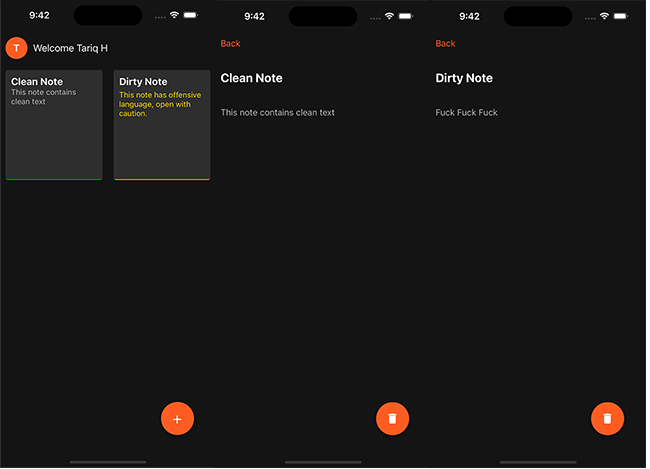

# CleanNoteApp

## Overview
This Note-Taking App is a comprehensive solution built with React Native and Redux, designed for mobile platforms. It allows users to create, view, and delete personal notes while ensuring a clean and user-friendly interface. Additional features include user profile management and content moderation to prevent negative or offensive language in the notes.



## Features
- **Note Management**: Users can create new notes, view existing notes in a grid format, and delete notes as needed.
- **Content Moderation**: The app integrates with a third-party API for profanity and toxicity detection to ensure that notes do not contain negative content.
- **User Profile**: Users can set and update their profile name, which is displayed on the home screen.
- **Navigation**: The app employs a stack navigator for smooth transitions between different screens: Home, Create Note, Note Detail, and User Profile.
- **State Management**: Redux is utilized for global state management across the app, with persisted state support to retain user data across sessions.
- **Styling**: The app features a dark theme with a consistent color scheme, providing an elegant and comfortable user experience.

## Setup and Installation

### Prerequisites
- Node.js installed on your machine
- React Native environment set up (refer to [React Native Environment Setup](https://reactnative.dev/docs/environment-setup))
- An Android or iOS device or emulator for testing

### Steps
1. Clone the repository to your local machine.
2. Navigate to the project directory and install dependencies using npm or yarn:
    ```
    npm install
    ```
    or
    ```
    yarn install
    ```


## Usage
- **Home Screen**: View all your notes in a grid format. Tap on a note to view details or the '+' button to create a new note.
- **Create Note**: Enter a title and body for your note. The 'Save' button is enabled only when both fields are non-empty. The app checks for negative content before saving.
- **Note Detail**: View the details of a selected note. You can delete the note using the trash icon.
- **User Profile**: Set or update your user profile name, which is displayed on the home screen.

## Profanity and Toxicity Detection API

The Note-Taking App incorporates a robust content moderation feature powered by a third-party API, specifically designed for profanity and toxicity detection in user-generated content. This API is integral to maintaining a positive and respectful environment within the app by automatically screening and flagging notes that contain negative or offensive language.

### How It Works
When a user attempts to save a new note, the app sends the text (both title and body) to the profanity and toxicity detection API. This is done using an HTTP POST request, where the text to be analyzed is included in the request's body. The API endpoint used for this purpose is `https://profanity-toxicity-detection-for-user-generated-content.p.rapidapi.com/`.

### Request Configuration
- **Method**: The app uses the POST method to send data to the API.
- **Headers**: The request includes headers for content type (`application/x-www-form-urlencoded`), an API key (`X-RapidAPI-Key`), and the API host (`X-RapidAPI-Host`). These headers ensure that the request is formatted correctly and authenticated.
- **Data**: The text from the note is URL-encoded and included in the request's body. This ensures that the text is safely transmitted to the API for analysis.

### Response Handling
The API responds with a JSON object containing the analysis results. The app parses this response to determine if the text contains any negative content based on predefined criteria. If negative content is detected, the app flags the note accordingly and warns the user.

### Importance in the App
Incorporating this API serves multiple purposes:
- **User Experience**: It helps in creating a safer and more welcoming environment for all users.
- **Content Quality**: Ensures that the notes created and stored within the app maintain a certain level of quality and decency.
- **Responsibility**: Demonstrates the app's commitment to responsible content management and user safety.


## Technical Details
- **React Native**: Provides the framework for building the mobile app with JavaScript.
- **Redux**: Manages the global state of the app, including notes and user profile data.
- **React Navigation**: Handles navigation between different screens in the app.
- **Redux Persist**: Persists the Redux state across app restarts.
- **Axios**: Facilitates HTTP requests to the content moderation API.
- **Expo Icons**: Supplies the icon set used in the app.

## Contributing
Contributions to the Note-Taking App are welcome. Please ensure to follow the project's coding standards and submit your pull requests for review.

## License
This project is licensed under the MIT License. See the LICENSE file for more details.

